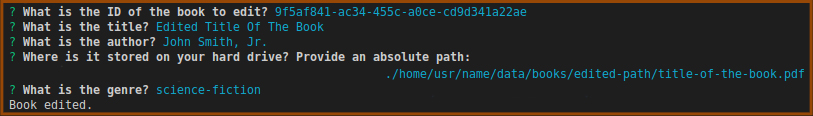

# Library - CLI (Workshop-2, Node.js)
A command-line interface (CLI) library application enabling: (1) books management and (2) access to books *via* customized server endpoints (see the concept diagram below). The project is the part of the Coders Lab course.


# Video demo
[](https://youtu.be/29KPPTXQNK0)

# Client-Server communication
To launch the server, type:
```
npm run client-server
```
## Get all books
1. Make a GET request on: `http://localhost:9000/book`
2. The client receives a **JSON-formatted** list of books stored in the library.
## Get a single book by ID
1. Make a GET request on: `http://localhost:9000/book?bookId={bookId}`
2. The GET request need to be provided with the chosen type of 'headers'. Available options:
```javascript
// Client receives:
// (1) a JSON-formatted book details (not a file) when:
headers: {
  accept: 'application/json'
}
// (2) the book as a PDF file when:
headers: {
  accept: 'application/pdf'
}
// (3) a HTML-formatted book details (not a file) when:
headers: {
  accept: 'text/html'
}
```
3. Next, the server generates a log to the database (see 'Logger' section for details).

# Library admin commands
* The file `./src/admin-cli.js` including all the commands is a script.
## Add
To add a new book to the database, type:
```
node ./src/admin-cli.js add
```
* available command alias: `a`

Next, the inquirer will ask for book details in stages:


## Delete
To delete a certain book, type:
```
node ./src/admin-cli.js delete
```
* available command alias: `d`

Then, the inquirer will ask for the book ID to delete the given book:


## Edit
To edit details of a certain book, type:
```
node ./src/admin-cli.js edit
```
* available command alias: `e`

Next, the inquirer will ask for the book ID to target the book, and then, you can edit book details in stages:



## Watch
* **This command requires working server** (see 'Client-Server communication' section to launch the server).

For real-time watching of the current log of last requested book, type:
```
node ./src/admin-cli.js watch
```
* available command alias: `w`

Now, you can see the last book request made by the client:


Logs are stored in the database (see 'Databases' and 'Logger' sections).

# Information
## ENV file
* This file was not included into the project (according to the workshop guideliness).
* Create such in `./src` with the following content:
```
NODE_PORT=9000                                // server port number
ACCEPTED_GENRES=novel,science-fiction,comedy  // accepted book genres
```
## Databases
1. books (as JSON)
2. logs (as plain text)
* Both are stored in `./src/assets` as raw files without extension (according to the workshop guideliness).
## Book as PDF file
* A PDF file for each book is from your hard drive. The books database stores the absolute file path you provided while adding a new book (see 'Library admin commands' section).
* A requested book file is downloaded to the client by the stream-based way.
## Logger
* After each single book request, the server generates a log to the logs database.
* Log structure:
```
{date}: BookId {bookId} was requested in format: {headers.accept}
```
where `headers.accept` indicates a 'headers' option provided with the GET request (see 'Get a single book by ID' section for details).
* You can start the logs real-time watching by using the **watch** command (see 'Library admin commands' section).

# Technologies
* JS (ES6)

# Download and Install
* Use the link from the 'Code' button to download the project.
* In the project directory, type:
```
npm i
```
to install necessary dependencies.
* **Create an .env file to ensure the app proper execution** (see 'ENV file' section for details).
* Next, see 'Client-Server communication' or 'Library admin commands' section to use the app.